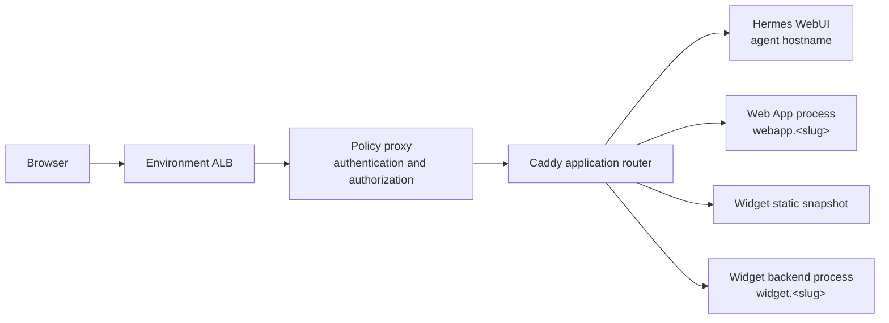

# App Workloads Design

App workloads are application surfaces hosted inside a Hermes runtime. Most are agent-created; a few support surfaces are platform-owned. HumR exposes two product shapes:

1. **Web Apps** are standalone browser applications with their own hostname.
2. **Widgets** are applications embedded in the Hermes WebUI under the agent's hostname.

They share process supervision, loopback ports, authentication infrastructure, and the Caddy router. They do not share product APIs, source layout, lifecycle commands, routing fragments, or registration semantics. “App workloads” names the common runtime layer; it is not a third application type. A static Widget does not create a process at all.

## Choosing the product shape

Use a **Web App** when the application should behave like an independent site:

- It needs a standalone browser destination or its own hostname.
- It should own `/`, so framework routes, absolute asset paths, WebSockets, and redirects work naturally.
- It may eventually be made public through a human-approved control-plane grant.
- Its start, stop, restart, environment, and registration lifecycle should be explicit.

Use a **Widget** when the application belongs inside the agent experience:

- It should appear in the WebUI's Widgets panel.
- It should share the agent's browser origin and live under `/widgets/<slug>/`.
- Its source and a small declarative manifest should be enough to reconstruct its runtime state.
- A static frontend is sufficient, or an optional backend can provide APIs, secrets, integrations, or server rendering.

The iframe used by the Widgets panel provides layout containment, not a security boundary. Widget JavaScript is same-origin with the WebUI by design, which allows theme integration and ordinary same-origin requests. Do not put untrusted applications in the Widget surface.

## Request topology



The policy proxy is the only browser-facing service in the task. It preserves the browser's requested hostname in `X-Forwarded-Host` and forwards the request to Caddy. Caddy then chooses among four destinations:

1. Requests on the bare agent host that do not match a Widget or platform-internal route go to Hermes WebUI.
2. `<slug>-<agent-host>/...` goes to the corresponding Web App process with the path unchanged.
3. `<agent-host>/widgets/<slug>/...` serves a generated static snapshot or proxies to a Widget backend, depending on the manifest.
4. Platform-owned paths such as `/webapps/__admin/` and `/widgets/__admin/registry.json` serve internal product support surfaces.

Web Apps and Widgets use separate generated Caddy fragments. A Web App mutation rewrites only `webapps.caddy`; Widget reconciliation rewrites only `widgets.caddy`. The static router imports both before falling back to WebUI, so neither product needs to understand the other's routes.

## Shared process supervision

Hermes runs two process-compose projects:

1. The **system project** supervises `system.webui` and `system.gateway`.
2. The **app-workloads project** supervises Web Apps and Widget backends.

Keeping system processes separate prevents application changes from restarting WebUI or interrupting active agent work. Within the app-workloads project, process names make ownership explicit:

- `webapp.<slug>` belongs to the Web Apps runtime.
- `widget.<slug>` belongs to the Widgets runtime.

Each product reads and mutates only its own namespace. The shared supervisor is infrastructure, not a shared application registry or admin API.

All supervised application processes bind to `127.0.0.1` on a port from the shared `4000–4019` pool. Web Apps receive `WEBAPP_PORT`; Widget backends receive `WIDGET_PORT`. The pool is intentionally small and sandbox-allowlisted. Port exhaustion in either product affects the other, so allocation is serialized through the shared app-workloads lock.

Static Widgets do not consume a port. A static Web App still consumes one because it runs an HTTP server behind its standalone host route.

## Sources of truth and generated state

The most important difference between the products is where registration comes from.

### Web Apps

The Web Apps CLI owns registration. A `webapps create` command adds `webapp.<slug>` to the app-workloads document, including its command, working directory, environment, assigned port, readiness probe, and enabled state. That entry is the authoritative registration record.

User Web App source belongs under `/workspace/webapps/projects/<slug>/`, but merely placing code there does not register an app. Platform-owned internal workloads are the exception to that source layout. Likewise, unregistering an app leaves its source and log behind.

### Widgets

The Widget directory and manifest are authoritative:

```text
/workspace/widgets/<slug>/
  widget.json
  ...frontend and backend source...
```

The directory name supplies the slug. `widget.json` declares presentation metadata, frontend mode, frontend entry when static, and an optional backend command. It does not store ports, status, routes, or other derived runtime state.

`widgets apply` discovers valid manifests and derives:

- The registry consumed by the WebUI Widgets panel.
- Static snapshots for static frontends.
- Widget Caddy routes.
- `widget.<slug>` supervisor entries for Widgets with backends.

This means a stale Widget process entry is not authoritative: the next reconciliation removes or replaces it according to the manifests.

### Persistent and derived paths

```text
/workspace/webapps/
  projects/<slug>/                       Web App source
  logs/<slug>.log                        Web App process logs

/workspace/widgets/<slug>/               Widget source and widget.json

/workspace/.config/widgets/
  registry.json                          generated panel registry
  static/<slug>/                         generated static snapshots
  logs/<slug>.log                        Widget backend logs

/workspace/.config/process-compose/
  app-workloads/process-compose.yaml     shared namespaced process state

/workspace/.config/caddy/
  webapps.caddy                          generated Web App routes
  widgets.caddy                          generated Widget routes
```

Everything under `/workspace/` survives task replacement through the persistent root. Product CLIs own the generated files; agents should not edit them directly.

## Web Apps

### Routing and origin

A user Web App named `dashboard` on `wolfie.humr.io` is served from `https://dashboard-wolfie.humr.io/`. The environment's wildcard DNS record, wildcard certificate, and per-agent ALB rule already cover that hostname, so creating an app does not provision cloud infrastructure.

The application sees `/` as its public root. It can therefore use absolute paths such as `/assets/app.js`, `/api/customers`, and `/ws` without knowing an agent-specific prefix. Its hostname also gives it a separate browser origin from WebUI and from other Web Apps.

Web Apps require HumR authentication and policy authorization by default. `webapps expose <slug>` produces a control-plane link where a human can approve time-limited public access; the agent cannot grant public access itself.

### Lifecycle

The `webapps` CLI is the sole mutation surface:

1. `webapps create` registers a stopped app and allocates its port.
2. `webapps start` enables the route, updates supervision, and waits for the process to accept loopback connections.
3. `webapps stop` removes the route and stops supervision while preserving source and logs.
4. `webapps restart` restarts an enabled process without changing registration.
5. `webapps set-env` changes the stored environment.
6. `webapps unregister` removes registration while preserving source and logs.
7. `webapps delete --yes` removes registration, source, and logs and therefore requires explicit user confirmation.

Readiness proves that the process accepted a TCP connection; it does not prove application correctness. Callers still need to exercise a meaningful HTTP path before reporting success.

### Web Apps panel and internal workload

The WebUI's Web Apps panel is read-only. It gets Web App status and logs from the platform-owned `webapp.__admin` process at `/webapps/__admin/`. That service resolves only `webapp.*` entries; Widget state is not part of its API. Start, stop, restart, and delete remain CLI operations.

The `__admin` slug is platform-internal and path-routed on the bare agent host. Other Web Apps are host-routed. Agents must not create or delete `__*` slugs.

### Bundled examples

Image-owned examples such as `snakes` are installed as ordinary Web Apps under `/workspace/webapps/projects/`. Their per-install marker chooses whether future deployments refresh the installed source or preserve user modifications. Once registered, they use the same process, route, log, and status mechanisms as user-created Web Apps.

## Widgets

### Manifest shapes

Every Widget has a frontend and uses one of three runtime shapes:

1. **Static frontend:** Caddy serves a generated snapshot. There is no backend process or app-workload port.
2. **Static frontend with backend:** Caddy serves the snapshot and proxies `/widgets/<slug>/api/...` to `widget.<slug>`. The backend sees `/api/...`.
3. **Backend-served frontend:** Caddy proxies the whole Widget path to `widget.<slug>` after stripping `/widgets/<slug>`. The backend sees `/` as its root.

The directory containing the declared static entry is the Widget's static site root. Reconciliation copies that complete directory into the generated snapshot. Caddy serves existing files at their relative paths and falls back to the entry only when no file matches, so ordinary paths such as `./app.js` and `./data/snapshot.json` work without a required asset layout. Put the entry under a dedicated directory such as `public/` when only part of the Widget source tree belongs in the snapshot. Backend processes bind to `127.0.0.1:$WIDGET_PORT` and receive `WIDGET_SLUG` and `WIDGET_BASE_PATH` in addition to the port.

Browser code must not receive backend credentials. Widget backends can use the same sandbox integrations and loopback Hermes API available to Web Apps, but must expose only the narrow application API the frontend needs.

### Registry and panel

The WebUI extension polls `/widgets/__admin/registry.json`, validates the generated registry, and loads the selected Widget in one reusable iframe. The registry contains only display and navigation data: slug, title, icon name, and same-origin URL.

`/widgets/__admin/registry.json` is a file route served directly by Caddy. It is not a `widget.__admin` process, does not use the Web Apps admin service, and does not expose the shared supervisor.

### Reconciliation

`widgets apply <slug>` validates the requested Widget and reconciles the complete Widget-derived generation. `widgets apply --all` performs the same reconciliation during boot.

Registry, snapshots, routes, and Widget-owned process entries are staged and published as one generation. A targeted invalid Widget blocks the apply; during full reconciliation, other invalid Widgets are reported and omitted rather than producing partial state. If publication or the supervisor reload fails, reconciliation restores the preceding complete generation.

Applying a Widget with a backend also waits for that targeted backend to become ready. `widgets list` reads manifests rather than trusting the generated registry, and `widgets logs` reads only backend logs.

Widgets do not have a separate stopped or unregistered state. Their presence and backend shape follow the manifest; their lifecycle is reconcile or delete rather than create, start, and stop.

`widgets delete <slug> --yes` permanently removes source, logs, registry presence, routes, and backend supervision. The operation is total and requires explicit user confirmation.

## Security and failure boundaries

1. **The policy proxy remains the browser gate.** Applications do not implement duplicate HumR authentication. Web App public access is the one deliberate exception and requires human approval.
2. **Caddy is the network boundary inside the task.** Application servers listen only on loopback and are never published directly.
3. **A Widget iframe is not a sandbox.** Same-origin access is intentional; Widget source is trusted agent-owned code.
4. **Frontend code never receives runtime secrets.** Privileged work belongs in a Web App server or Widget backend.
5. **Process isolation is operational, not resource isolation.** App workloads share the Hermes sandbox, task CPU and memory, filesystem permissions, and inherited environment. There are no per-workload cgroups, so a runaway process can affect Hermes and sibling workloads.
6. **Product ownership limits logical blast radius.** Namespaces, route fragments, and CLIs prevent one product from deleting or presenting the other's resources, while the separate system supervisor protects WebUI and gateway processes from application project updates.

## Cold start and recovery

On task replacement, the persistent root restores `/workspace/`. Startup then:

1. Reconciles Widget manifests into the registry, snapshots, routes, and `widget.*` entries.
2. Ensures `webapp.__admin` and bundled Web Apps are registered and regenerates Web App routes.
3. Seeds the separate system project.
4. Starts the system and app-workloads process-compose projects.
5. Waits for WebUI and then starts Caddy with both product route fragments.

Enabled Web Apps resume from their persistent registration records. Widgets resume from their persistent manifests and are re-derived. This difference is intentional: Web Apps have an imperative lifecycle, while Widgets are declarative.

## Current non-goals

- App workloads manage HTTP applications, not un-routed background workers.
- The WebUI does not mutate Web App lifecycle state.
- Widgets do not have standalone or public hostnames.
- There are no per-workload CPU or memory limits.
- Deletion has no user-facing trash or restore workflow.

## Code map

- **Shared runtime:** `template_repos/hermes_agent/humr_runtime/process_supervisor/`, `http_router/Caddyfile`, and `webui.sh`.
- **Web Apps runtime:** `template_repos/hermes_agent/humr_runtime/webapps/`, including the CLI, route helpers, bundled examples, and `admin/` status service.
- **Widgets runtime:** `template_repos/hermes_agent/humr_runtime/widgets/`, including manifest validation, reconciliation, routing, and the CLI.
- **WebUI surfaces:** `template_repos/hermes_agent/webui-extension/humr-webapps.*` and `humr-widgets.*`.
- **Agent contracts:** `template_repos/hermes_agent/skills/development/webapps/` and `widgets/`.
- **Cloud routing:** `humanityrules_app/services/infra_customer/deploy_base.py`, `deploy_app.py`, and `appconfig.py`.
