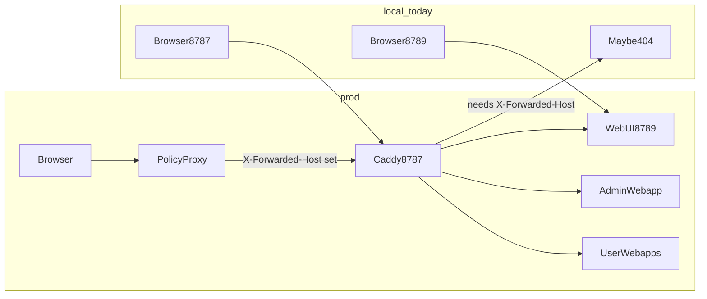

# Cursor Conversation

**Conversation ID:** `1512a25d-8288-4d28-a709-7f1d971d3488`
**Extracted:** 2026-05-28 00:15

---

## User

Create a docker-compose yaml that launches the Hermes agents locally without having to deploy. Verify that it works. We don't need the LLM to work (through Bedrock credentials or otherwise). But, I need to be able to make changes at least in the Hermes UI and see them quick. Let's get to that state, and after that we'll iterate.

---

## Assistant

Exploring the Hermes agent setup to understand how it runs and what we need for local docker-compose development.

---

## Assistant

Creating docker-compose with volume mounts on the persistent-root paths so UI extension edits are visible without rebuilds. Checking whether Docker is available, then building and running.

---

## Assistant

The `doh_runtime` read-only bind mount conflicts with the image sync rsync. Mounting only `webui-extension` for fast UI iteration.

---

## Assistant

Bind-mounting `webui-extension` before init makes the persistent root look non-empty, so full initialization is skipped. Checking whether we should fix the init marker logic or adjust the compose mount strategy.

---

## Assistant

Fixing init detection to use the marker file instead of directory emptiness, so bind mounts don't skip full initialization.

---

## Assistant

Mounting `doh_runtime` at the image path so the init fix is picked up without a full rebuild.

---

## Assistant

Host-mounted `webapps` lost its execute bit. Fixing permissions and rebuilding the image with the init fix.

---

## Assistant

Hermes runs locally via Docker Compose. Here is what is in place and verified.

## What was added

**`template_repos/hermes_agent/docker-compose.yml`** — builds the same image as production and runs the full stack (persistent-root chroot, supervisor, WebUI, Caddy).

```bash
cd template_repos/hermes_agent
docker compose up --build
```

**URLs**

1. **http://localhost:8789** — Hermes WebUI (use this for extension work)
2. **http://localhost:8787** — Caddy front door (prod-like; needs `X-Forwarded-Host: localhost` without policy-proxy)

**Fast UI iteration:** `webui-extension/` is bind-mounted into the chroot. Edit JS/CSS, hard-refresh the browser — no rebuild. Confirmed live.

**LLM optional:** Defaults use dummy AWS credentials so `aws-signer` starts; chat/Bedrock will fail unless you add real creds in `.env` (copy from `.env.example`).

## Bugfixes discovered while bringing it up

1. **`persistent-root-runner.sh`** — Init now checks for `.doh-hermes-persistent-root` instead of “directory non-empty”, so a pre-mounted `webui-extension` no longer skips full root initialization.
2. **`doh_runtime/webapps`** — Set executable (`100755`) so nono can run it after rsync.

## Verified

- Container **healthy**
- `GET /health` → `{"status":"ok",...}`
- Extension assets served at `/extensions/doh-webapps.js` and `/extensions/doh-integrations.js`
- Live mount: file change visible immediately over HTTP

**Note:** First boot rsyncs the full rootfs into the `hermes-data` volume (~1–2 minutes). Later starts are much faster. Gateway logs may show MCP `agg` connection failures without the DOH integrations broker — expected for UI-only local dev.

The container is running now at the URLs above. Next iteration could be a `docker-compose` profile for mounting `doh_runtime/` during runtime work, or a dev entrypoint that skips chroot for faster boots — say if you want either.

---

## User

Shut it down

---

## Assistant

Stopped. The `hermes-agent-local` container and its network are gone.

The `hermes-data` volume is still on disk so the next `docker compose up` skips the slow first-boot rsync. To wipe that too: `docker compose down -v`.

---

## User

it the location of the the volume hermes-data somewhere in Docker land?

---

## Assistant

Yes. Compose names it `hermes-data` in the file, but Docker stores it as:

**`hermes_agent_hermes-data`**

(project name + volume name)

On your machine the mountpoint is:

**`/var/lib/docker/volumes/hermes_agent_hermes-data/_data`**

That path is inside Docker’s Linux VM, not a normal macOS folder. On Docker Desktop you don’t browse it directly in Finder; you reach it via Docker, for example:

```bash
docker run --rm -v hermes_agent_hermes-data:/data alpine ls -la /data
```

That volume is the initialized Hermes persistent root (`/hermes-persistent-root` in the container): workspace, `.hermes` state, brew tree, etc. It survives `docker compose down` unless you use `docker compose down -v` or `docker volume rm hermes_agent_hermes-data`.

---

## User

So, I see it, but of course nothing works. Let's analyze what could we make work next. For example, can we make webapps work?

---

## Assistant

Analyzing how webapps are wired in the Hermes stack and what's blocking them in local docker-compose.

---

## Assistant

Here is what is broken locally, what is already close to working, and a practical path to get **webapps** working.

## Why “nothing works” on :8789

The compose file steers you to **http://localhost:8789** for the WebUI. That port is Hermes only — it does not run Caddy or `/webapps/*` routes.

The Web Apps panel calls:

```10:10:template_repos/hermes_agent/webui-extension/doh-webapps.js
  const API_URL = '/webapps/__admin/api/webapps';
```

That path is served by the `__admin` FastAPI app, which only exists behind **Caddy on :8787**. On :8789 the fetch fails → “Status unavailable.” Same story for Integrations (needs the DOH control plane + integrations broker, which compose does not start).

Production fixes this with **policy-proxy** in front of Caddy: it sets `X-Forwarded-Host` and forwards to :8787. Local compose has no equivalent.



## What already works inside the container

When the stack is up, most of the webapps **machinery** is there:

1. **process-compose** supervises `__admin`, `system.gateway`, and user apps (ports 4000–4019).
2. **`webapps` CLI** is on PATH inside the nono sandbox.
3. **`DOH_PUBLIC_HOSTNAME=localhost`** is set in compose.
4. **Static/extension UI** on :8789 if you only care about layout (not data).

So “make webapps work” is mostly a **routing / URL** problem, not missing binaries.

## What “webapps working” actually means (three layers)

| Layer | What you want | Blocker locally |
|-------|----------------|-----------------|
| **1. Web Apps panel** | Sidebar lists apps, shows status | API on :8789; Caddy on :8787 needs `X-Forwarded-Host: localhost` |
| **2. Create/manage apps** | `webapps create` from agent terminal | Should work; verify `__admin` is Ready in process-compose |
| **3. Open app in browser** | `https://hello.localhost/` (or similar) | Caddy routes match **X-Forwarded-Host**, not **Host**; no wildcard TLS/DNS (fine for HTTP) |

Layers 1 and 3 share the same root cause: Caddy was written for policy-proxy semantics, not direct browser access.

```33:37:template_repos/hermes_agent/doh_runtime/Caddyfile
	@bare header X-Forwarded-Host {$DOH_PUBLIC_HOSTNAME}
	handle @bare {
		reverse_proxy 127.0.0.1:8789 {
```

User app routes are the same — they key off `X-Forwarded-Host`, not `Host`:

```203:204:template_repos/hermes_agent/doh_runtime/webapps_lib.py
        f"@{name} header X-Forwarded-Host {slug}.{base_host}\n"
```

## Recommended next step: fix local routing (smallest high-value change)

**Goal:** One browser URL that serves WebUI + `/webapps/__admin/api/*` + user subdomains.

### Option A — Local Caddy dev matchers (simplest, ~20 lines)

When `DOH_PUBLIC_HOSTNAME=localhost`, also match **`Host`** (and optionally `X-Forwarded-Host`) in:

- `Caddyfile` bare-host fallback → WebUI on :8789  
- `webapps_lib.py` route generation for `__admin` and user slugs  

Then:

- **Web UI + panel:** http://localhost:8787/  
- **User app:** http://hello.localhost:8787/ (`*.localhost` → 127.0.0.1 in modern browsers)

No second container; matches prod behavior closely enough for dev.

### Option B — Tiny compose “policy-proxy” shim

Add a minimal forwarder on :8080 → :8787 that always sets `X-Forwarded-Host: localhost` (and preserves subdomain in `Host`). Zero changes to Caddy/webapps_lib; extra moving part.

### Option C — Document the hack (no code)

Use :8787 and send headers manually (ModHeader, curl). Fine for debugging, poor for daily UI work.

**Recommendation:** Option A for day-to-day extension work; keep :8789 only for “WebUI-only” debugging.

## After routing works — quick verification checklist

With compose up:

1. **Panel:** `curl -H 'X-Forwarded-Host: localhost' http://localhost:8787/webapps/__admin/api/webapps` → JSON with `__admin`, `system.gateway`.
2. **Create app** (in Hermes terminal or `docker exec`):
   ```bash
   mkdir -p /workspace/webapps/projects/hello
   echo '<h1>hi</h1>' > /workspace/webapps/projects/hello/index.html
   webapps create hello \
     --command 'python3 -m http.server "$WEBAPP_PORT" --bind 127.0.0.1' \
     --cwd /workspace/webapps/projects/hello
   webapps list
   ```
3. **Browser:** http://hello.localhost:8787/ (after Option A) or with headers (today).

## Other “make it work” items (priority order)

1. **Webapps routing (above)** — high impact, small diff.  
2. **Single entry URL in compose** — point docs/healthcheck at :8787 once routing works; deprecate :8789 for humans.  
3. **LLM chat** — optional; real Bedrock creds in `.env` (you already have a template).  
4. **Integrations panel** — needs `DOH_CONTROL_PLANE_URL`, `DOH_ENV_BEARER`, `DOH_OWNER_USERNAME`, `DOH_APP_SLUG` + local DOH API; integrations broker is a bigger lift.  
5. **Outbound network in nono** — sandbox blocks everything except :443; apps that `pip install` or call external APIs on other ports need profile/compose relaxation.  
6. **HTTPS links** — `url_for()` emits `https://...`; local HTTP is fine; cosmetic unless something hard-requires TLS.

## Summary

Webapps are not missing from the image — they are **mis-routed for local browsers**. The Web Apps panel fails because you are on :8789; user URLs fail because Caddy expects policy-proxy headers. The next concrete win is **local Host-based Caddy matching on :8787**, then validate with `webapps create` + the panel.

If you want to proceed, I can implement Option A in `Caddyfile` + `webapps_lib.py` (gated on `DOH_PUBLIC_HOSTNAME=localhost` or a `DOH_LOCAL_DEV=1` env) and update `docker-compose.yml` to advertise :8787 as the main URL.

---

## User

option B, where does that change live?

---

## Assistant

Checking whether an existing policy-proxy can be reused for local compose.

---

## Assistant

Option B is **compose-only local dev** — it does not change the Hermes image or `doh_runtime/` routing code.

## Where it lives

**1. `template_repos/hermes_agent/docker-compose.yml`**

Add a second service (e.g. `local-proxy`) on the same Compose network:

- Publishes the port you open in the browser (often **8788**, to mirror prod’s policy-proxy slot).
- Upstream: `http://hermes:8787` (Caddy inside the Hermes container).
- Optionally stop publishing **8789** to the host so there’s one obvious URL.

**2. New files under `template_repos/hermes_agent/docker/`** (suggested home for the shim)

Option B is a **small forwarder**, not the full policy stack. Typical layout:

- `docker/local-proxy.py` — ~30 lines: copy `Host` → `X-Forwarded-Host`, proxy to `hermes:8787`
- or `docker/local-proxy.Caddyfile` / `nginx.conf` if you prefer config over code
- optional `docker/Dockerfile.local-proxy` if the shim isn’t “run this one-liner image”

Those paths are **dev-only**; they are not copied by the Hermes `Dockerfile` and are not deployed to ECS.

**3. What does *not* change (by design)**

- `doh_runtime/Caddyfile`
- `doh_runtime/webapps_lib.py`
- `webui-extension/`
- Hermes `Dockerfile` / production deploy

Prod keeps using real policy-proxy; local compose adds a stand-in in front of Caddy.

## Not the same as reusing `template_repos/policy_proxy/`

The real policy proxy lives in **`template_repos/policy_proxy/`** and is what sets `X-Forwarded-Host` in production:

```91:93:template_repos/policy_proxy/policy_proxy/proxy.py
    original_host = request.headers.get("host", "")
    if original_host:
        headers["X-Forwarded-Host"] = original_host
```

You *could* wire that into compose instead of a minimal shim, but then the change also spans:

- `template_repos/policy_proxy/` (unchanged code, but used as a second image/service)
- compose env for JWT/PDP/`DOH_AUTH_BASE_URL`/session cookies — much heavier than “make webapps routable locally”

That’s a **variant** of B (prod-faithful), not the lightweight B from the earlier note.

## Traffic shape

```text
Browser → localhost:8788  (local-proxy service)
              ↓  sets X-Forwarded-Host from Host
          hermes:8787       (Caddy, unchanged)
              ↓
          WebUI / __admin / user webapps
```

So: **compose + `hermes_agent/docker/*` for the shim**; Hermes runtime stays as-is. If you want this implemented, say whether you prefer the minimal Python forwarder or mirroring port 8788 with the real `policy_proxy` image (with auth bypass/mocks).

---

## User

but it should be named "local_policy_proxy", and reside alongside policy_proxt

---

## Assistant

Creating `template_repos/local_policy_proxy` alongside `policy_proxy` and wiring it into Hermes compose.

---

## Assistant

Creating `template_repos/local_policy_proxy` alongside `policy_proxy` and wiring it into compose.

---

## Assistant

Caddy expects `localhost` but the proxy forwards `localhost:8788`. Stripping the port from `X-Forwarded-Host`.

---

## Assistant

Here is the layout you asked for:

## Repo layout (alongside `policy_proxy`)

```
template_repos/
  policy_proxy/              # production SSO + PDP sidecar
  local_policy_proxy/        # dev-only forwarder (new)
    Dockerfile
    README.md
    pyproject.toml
    requirements.txt
    local_policy_proxy/
      __init__.py
      config.py
      app.py
      proxy.py
      main.py
```

## Compose wiring (only references it)

**`template_repos/hermes_agent/docker-compose.yml`** — second service `local_policy_proxy`, build context `../local_policy_proxy`.

Hermes runtime (`doh_runtime/`) is unchanged; Caddy still expects `X-Forwarded-Host`, and `local_policy_proxy` sets it (with the port stripped so `localhost:8788` → `localhost`).

## Usage

```bash
cd template_repos/hermes_agent
docker compose up --build
```

Open **http://localhost:8788/** — WebUI, Web Apps panel (`/webapps/__admin/api/webapps`), and user apps at `http://<slug>.localhost:8788/`.

Verified: admin API returns JSON, root returns 200. Stack is up if you want to try it in the browser.

---

## User

Journal commit

---
